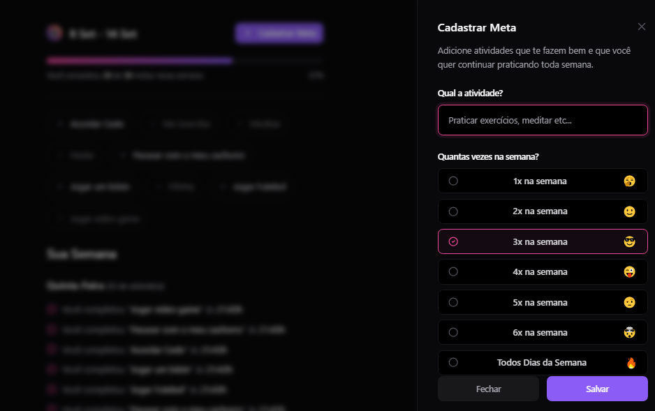
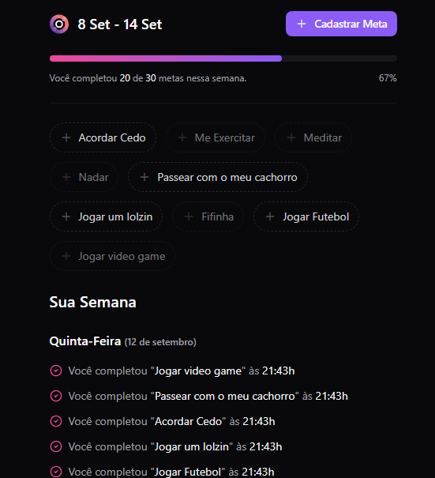

# Imersão Rocketseat IOB

Este é um projeto desenvolvido com base nas aulas de Imersão Dev em **ReactJS** e **NodeJS** da empresa [RocketSeat](https://www.rocketseat.com.br/), voltado a ajudar as pessoas no âmbito de saúde mental. O sistema oferece uma lista de tarefas onde o usuário pode cadastrar e marcar tarefas como completadas à medida que forem finalizadas.

## 🚀 Tecnologias Utilizadas

O projeto foi desenvolvido utilizando as seguintes tecnologias:

- **ReactJS**: Biblioteca JavaScript para a criação de interfaces de usuário.
- **TypeScript**: Superset do JavaScript que adiciona tipagem estática.
- **NodeJS**: Ambiente de execução JavaScript server-side.

## 📋 Funcionalidades

- Cadastro de tarefas (To-do list)
- Marcação de tarefas como concluídas
- Interface amigável e intuitiva
- Backend robusto para gerenciamento de tarefas

## 🖼️ Demonstração

**Vídeo de Demonstração:**


**Screenshots do Sistema:**




## 🛠️ Instalação

### Pré-requisitos

- **Node.js** instalado na máquina (versão >= 14)
- Gerenciador de pacotes **npm** ou **yarn**

### Passo a Passo

1. **Clone este repositório**:

   ```bash
   git clone https://github.com/anderson-rdias/imersao-rocketseat-iob.git
   ```

2. **Instale as dependências**:

  ```bash
  cd imersao-rocketseat-iob
  npm install
  # ou
  yarn install
 ```

3. **Execute a aplicação**:

```bash
npm run dev
# ou
yarn dev
```

O projeto será executado em **http://localhost:5173/**.

## 🤝 Contribuição

Sinta-se à vontade para contribuir com o projeto. Basta seguir as etapas abaixo:

1. Faça um fork do projeto.
2. Crie uma nova branch para sua feature (git checkout -b feature/nova-feature).
3. Faça o commit das suas alterações (git commit -m 'Adiciona nova feature').
4. Push para a branch (git push origin feature/nova-feature).
5. Abra um Pull Request.

Desenvolvido com 💜 por Anderson Dias
